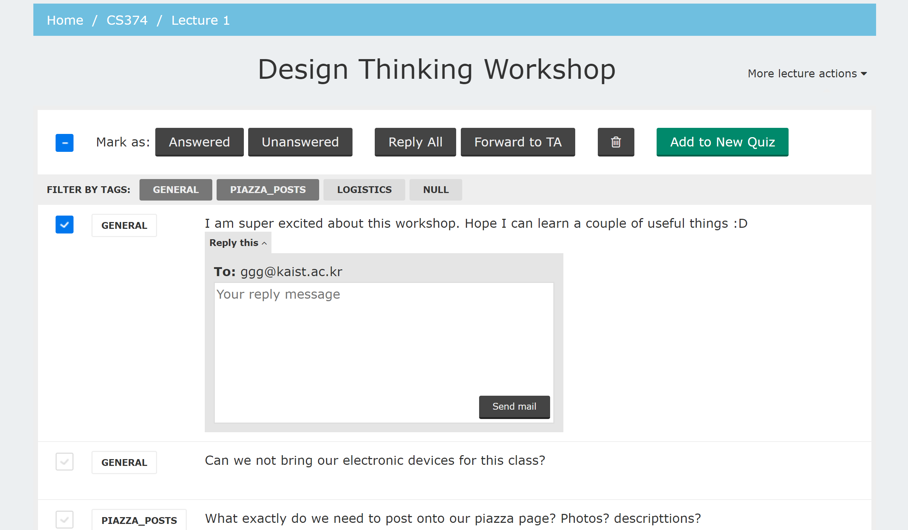

# Listen() Project

_Listen() Project_ is our team's term project for (CS374 @ [KAIST](http://kaist.edu) 2017 Spring) Introduction to Human-Computer Interaction course.

## Team Members

* Bolat Ashim ( [Github](https://github.com/bolatashim) )
* Hyoung-Wook Jin ( [Github](https://github.com/jhw123) )
* Silap Aliyev ( [Github](https://github.com/oaakx) )
* Tae Soo Kim ( [Github](https://github.com/tsook) )

## POV (Point of View) For The Project

> (Who?) **KAIST professors** need to (What?) **increase the amount of student participation in classes** because (Why?) **it boosts the quality of their lecture and course and helps them manage their course.**

## Video

* [Watch on Youtube](https://www.youtube.com/watch?v=IwefWBHloOc) (warning: terrible actors)

## Interface

### Instructor's User-Interface

The instructor interface starts from **index page** (`index.html`) which has the courses listing. From here he/she can go to previous lectures of given course and add new lectures. Upon adding a new lecture they can receive questions from student users who use the student interface. Also, one can review and keep track of the data from previous lectures through the review page.  

Each page has its own JavaScript file which contains the all of the interactions. The `scripts` folder contains these files, which are named in a similar way to their corresponding HTML files.

## Student's User-Interface

This interface has two parts:

* **login page** (`student_login.html`) - for logging in, and
* **index page** (`student_index.html`) - for the student to be able to ask questions in the active lecture.

## Screenshots

